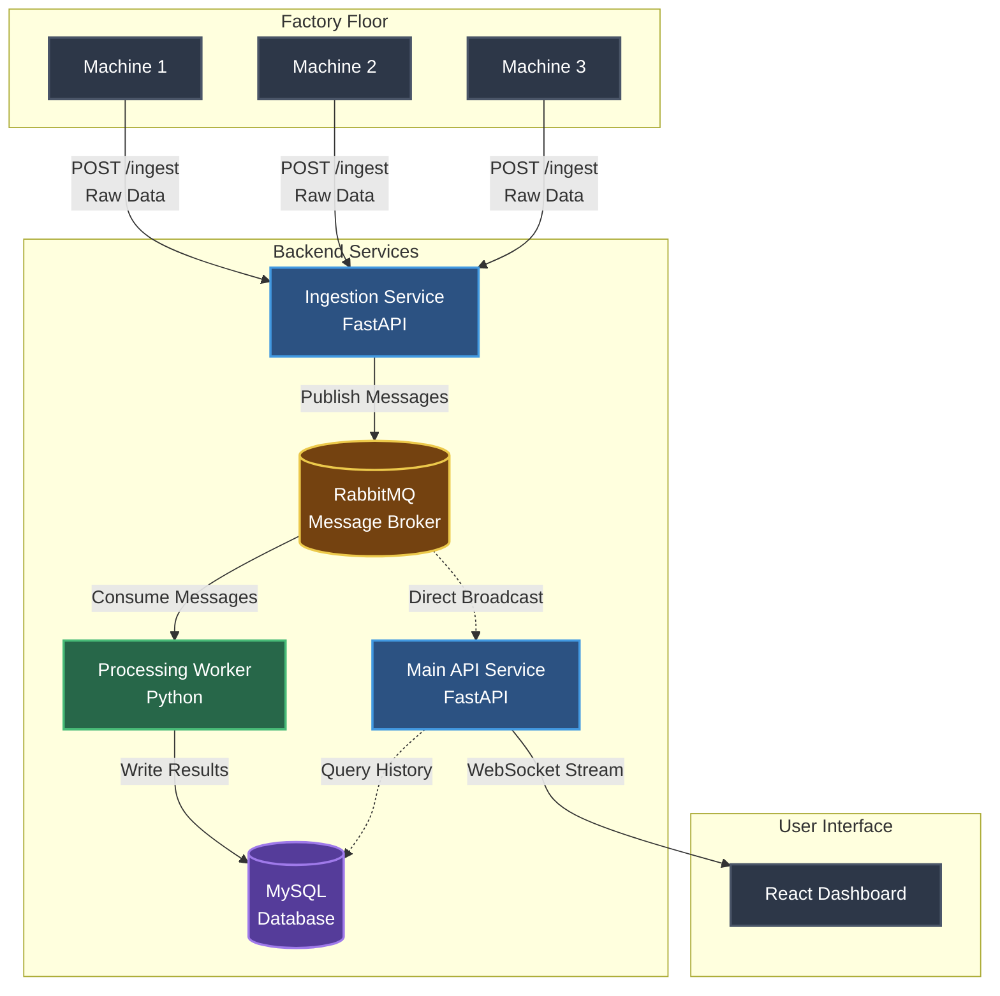
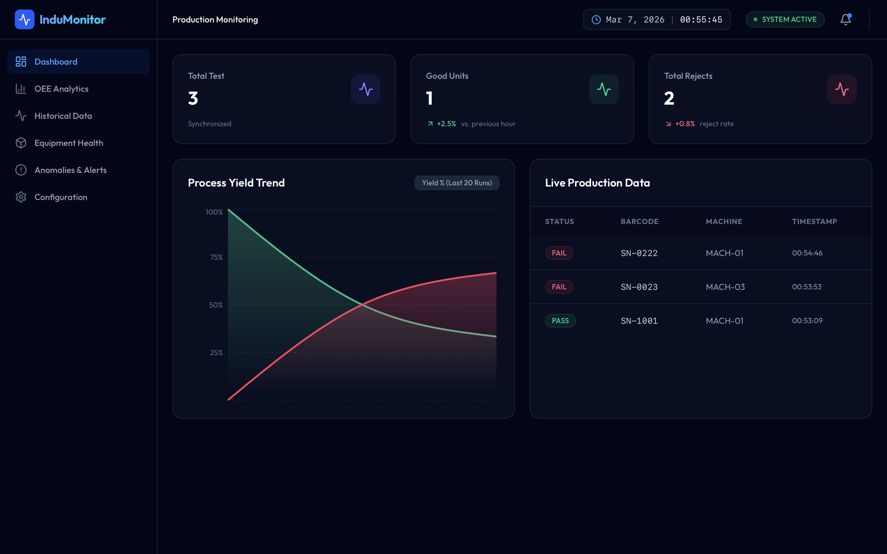

# 🏭 Production Monitoring System

## Project Overview
The **Production Monitoring System** is a highly scalable, real-time data pipeline and dashboard application designed to provide comprehensive visibility into production environment. Built with a robust microservices architecture, this system efficiently ingests, processes, and visualizes high-volume test data from production machines. It empowers engineering teams to monitor test results, enforce quality control rules, and optimize throughput with instant, data-driven insights.

## Key Features
- **Real-Time Data Ingestion:** Collects raw test data directly from production machines with minimal latency.
- **Automated Validation & Processing:** Applies custom business rules on the fly to determine pass/fail statuses for every test.
- **Live Broadcasting Integration:** Uses WebSockets to push real-time updates directly to the frontend dashboard.
- **Asynchronous Architecture:** Implements a decoupled microservices pattern using message queues (RabbitMQ) to handle sudden spikes in production data without dropping packets.
- **Modern Responsive Dashboard:** A sleek, user-friendly SPA interface providing immediate visualization of production metrics and testing outcomes.

## System Architecture
The application is built using a reliable, event-driven microservices approach to guarantee scalability and high performance.



### Microservices Breakdown
- **Ingestion Service (FastAPI):** Acts as the "front door," accepting incoming machine data via REST API, validating the payload, and publishing messages to the message broker.
- **Processing Service (Python Worker):** The core computing engine that consumes messages from the queue, evaluates test criteria (PASS/FAIL), and persists the categorized results to the database.
- **API Service (FastAPI):** Serves historical data via REST endpoints and maintains live WebSocket connections to broadcast updates to the frontend.
- **Frontend Dashboard (React):** A modern frontend application acting as an interactive window into live, streaming production data.

## Technology Stack
**Backend & Infrastructure:**
- Python 3.10+
- FastAPI
- SQLAlchemy (ORM)
- MySQL Database
- RabbitMQ (Message Broker)
- Docker & Docker Composes

**Frontend:**
- TypeScript
- React & Vite
- Tailwind CSS
- Recharts (Data Visualization)

## Project Structure
```text
.
├── backend/
│   ├── ingestion/       # Data ingestion microservice (FastAPI)
│   ├── processing/      # Background worker for data evaluation
│   └── api/             # Main API and WebSocket service
├── frontend/            # React + Vite dashboard application
├── docker-compose.yml   # Container orchestration configuration
└── README.md
```

## Installation Guide
### Prerequisites
- **Docker** (Docker Desktop or Docker Daemon must be running)
- **Docker Compose**
- **Git**

### Setup Instructions
1. **Clone the repository:**
   ```bash
   git clone <repo_url>
   cd manufacturing-backend
   ```

2. **Build and launch the containers:**
   ```bash
   docker-compose up --build
   ```

## Usage / Running the System
Once the Docker containers are successfully built and running, you can interact with the various parts of the system:
- **Frontend Dashboard:** [http://localhost:5173](http://localhost:5173)
- **Data Ingestion API Documentation:** [http://localhost:8001/docs](http://localhost:8001/docs)
- **Main API Documentation:** [http://localhost:8000/docs](http://localhost:8000/docs)

### Running Automated Tests
To ensure system integrity, execute the automated test suite within the container:
```bash
docker-compose run api pytest
```

## API Endpoint Example
**Simulating Machine Data Ingestion:**
You can simulate a machine completing a test by sending a POST request to the ingestion service:

```bash
curl -X POST http://localhost:8001/ingest \
  -H "Content-Type: application/json" \
  -d '{
    "barcode": "SN-1001",
    "machine_id": "MACH-01",
    "product_id": "PROD-A",
    "test_step": "voltage_test",
    "measured_value": 85.5,
    "timestamp": "'$(date -u +"%Y-%m-%dT%H:%M:%SZ")'"
  }'
```

## System Workflow
1. **Data Collection:** A machine completes a testing step and sends a JSON payload to the `/ingest` endpoint.
2. **Buffering:** The Ingestion Service validates the data and places the payload into a RabbitMQ queue, returning an immediate response to the machine.
3. **Processing:** The Python Worker asynchronously pulls the payload, evaluates the `measured_value` against predefined logic, and logs the result.
4. **Storage:** The finalized test result (PASS/FAIL) is reliably saved into the database.
5. **Real-Time Update:** The API Service pushes the newly evaluated data to active frontend clients via WebSockets, instantly updating the dashboard charts.

## Example Output & Screenshots

<div align="center">
  
</div>

> **Sample Log Event:**
> `[PASS] SN-1001 | MACH-01 | Voltage Test: 85.5V | Recorded via WebSocket`

